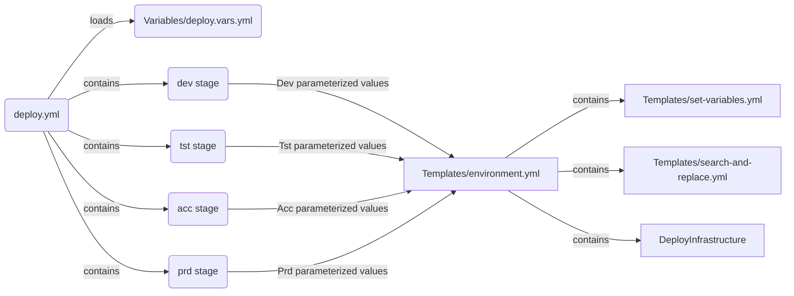

# A basic DTAP environment with Azure Pipelines

This repository contains a structure which can be used for a basic dev, test, acceptance and production environment. The YAML files are used for Azure Pipelines.

## Structure

The folder structure is as follows:

```
├── Infrastructure
│   ├── Modules
│   │   └── example.bicep
│   ├── Parameters
│   │   └── main.parameters.json
│   └── main.bicep
├── Pipeline
│   └── deploy.yml
├── README.md
├── Templates
│   ├── environment.yml
│   ├── search-and-replace.yml
│   └── set-variables.yml
└── Variables
    └── deploy.vars.yml
```

**Infrastructure**

This folder contains the infrastructure files. In this example Azure Bicep has been chosen. Besides infrastucture files the infrastructure folder contains the parameter files.

**Pipeline**

The pipeline folder contains the deployment pipeline. This deployment pipeline orchestrates the D,T, A and P stages.

**Templates**

This folder contains re-useable YAML templates. For example templates like 'set-variable.yml' or 'search-and-replace.yml' can be used frequently and are placed in their own YAML file to be re-used.

**Variables**

This folder contains the variables for the pipelines. In this file variables can be declared, also for re-useable purposes.

## Schema



This flowchart represents the YAML markup. Read this schema from left to right:
1. deploy.yml is the Azure Pipeline which contains the various DTAP stages. It also loads the `deploy.vars.yml` which contains re-useable variables that can be used in the whole pipeline.
2. The various stages in `deploy.yml`
3. Each stage points to the `environments.yml` templates which need specific parameter inputs (environment, serviceConnectionName and resourceGroupName)
4. In `environments.yml` the actual deployment to Azure takes place. Besides the deployment it is possible to set variables in runtime or do a search and replace for specific environment values.
